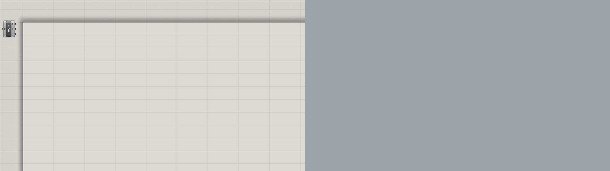

# Cordyceps

**MCP server for Grasshopper.** Gives AI agents or scripts direct control over your parametric design canvas and select Rhino viewport + rendering tools.

## Requirements

- **Rhino 8.21+** (requires .NET 8)
- **MCP client with Streamable HTTP**: Claude Code, Cursor, VS Code Copilot, or any compatible client

## Quick Start

**[Download Cordyceps.gha](https://github.com/brookstalley/cordyceps/raw/main/releases/Cordyceps.gha)**

**Install**: Copy `Cordyceps.gha` to your Grasshopper components folder. In Grasshopper: *File → Special Folders → Components Folder*.

* You may need to unblock the file before running. Windows: right click Cordyceps.gha -> properties -> Unblock. 

**Start**: Drop the Cordyceps component on your canvas (*Params → Util → Cordyceps*). The server starts on port 26929 by default.

Component inputs:
- **Port** (default 26929): HTTP port for the MCP server
- **DebugLevel** (default 0): Logging verbosity. 0 = server start/stop only, 1+ = request/response details

**Connect**: Configure your MCP client:

*Claude Code (command line):*
```cmd
claude mcp add --transport http http://127.0.0.1:26929/mcp
```

*Most others (config file):*
```json
{
  "mcpServers": {
    "grasshopper": {
      "type": "streamable-http",
      "url": "http://127.0.0.1:26929/mcp"
    }
  }
}
```

## Usage

**Natural language**: Tell an AI what you want—*"Create a radial array of cylinders with sliders for count and radius"*—and it builds the definition using MCP tools.

**Scripting**: Call tools directly from Python or any MCP client:

```python
async with ClientSession(transport) as session:
    slider = await session.call_tool('gh_canvas', {'action': 'add', 'type': 'Number Slider', 'x': 50, 'y': 50})
    circle = await session.call_tool('gh_canvas', {'action': 'add', 'type': 'Curve/Circle', 'x': 200, 'y': 50})
    await session.call_tool('gh_wire', {
        'action': 'connect',
        'sourceId': slider['id'], 'sourceParam': '0',
        'targetId': circle['id'], 'targetParam': 'R'
    })
```

## Example

Here's what happens when you give Claude this natural language prompt:

> Make an animated GIF that shows the full journey from parametric modeling to photorealistic render. The subject is a small collection of geometric forms — maybe five or six objects with varied shapes, scales, and proportions. Arrange them as a pleasing composition. The GIF shows three phases: building the geometry in Grasshopper with solver enabled and frequent captures, then baking and setting up a beautiful render in Rhino with previews disabled, and finally a smooth raytraced orbit. Use an outdoor environment and a variety of materials to make it visually rich. The GIF must include both canvas and viewport in every frame.



The AI interprets the request and builds everything autonomously—creating parametric geometry in Grasshopper, baking to Rhino, applying PBR materials, configuring the render environment and lighting, and capturing a smooth orbiting animation.

## Tools

Cordyceps provides **7 tools with 92 actions**—deliberately consolidated to minimize context window usage. Rather than exposing every operation as a separate tool (which would require the model to process dozens of tool definitions), related operations are grouped under a single tool with an `action` parameter. This keeps the tool list compact while preserving full functionality.

### Grasshopper Tools

| Tool | Actions | Description |
|------|---------|-------------|
| `gh_canvas` | add, delete, move, rename, find, search, list, info, bounds, validate, constant, bake, zoom, view, get, set, config, preview, enable, group_* | Components, values, groups |
| `gh_wire` | connect, disconnect, list, clear, validate | Connection management |
| `gh_document` | info, save, clear, solver, recompute, undo, redo, snapshot, revert, snapshots, capture_* | Document operations and capture |
| `gh_script` | get, set, configure, info | Script components |
| `gh_inspect` | status, outputs, trace, disconnected, geometry, log, reports, categories, docs | Inspection and debugging |

### Rhino Tools

| Tool | Actions | Description |
|------|---------|-------------|
| `rhino_scene` | objects, select, deselect, set_layer, set_name, layers, layer_*, hide, show, delete, script | Scene and layer management |
| `rhino_render` | display, camera, zoom, modes, render, settings, ground, sun, skylight, material_*, env_* | Viewport, render settings, materials, environments |

## Resources

MCP resources provide documentation to clients. Source files are in [`src/Cordyceps/Knowledge/`](src/Cordyceps/Knowledge/).

**Guides:**
- `gh://docs/getting-started` — [GettingStartedGuide.md](src/Cordyceps/Knowledge/GettingStartedGuide.md) — Workflow and key concepts
- `gh://docs/data-trees` — [DataTreesGuide.md](src/Cordyceps/Knowledge/DataTreesGuide.md) — Grasshopper's data tree system
- `gh://docs/type-system` — [TypeSystemGuide.md](src/Cordyceps/Knowledge/TypeSystemGuide.md) — Type compatibility and coercion
- `gh://docs/best-practices` — [BestPracticesGuide.md](src/Cordyceps/Knowledge/BestPracticesGuide.md) — Patterns and recommendations
- `gh://docs/component-patterns` — [ComponentPatternsGuide.md](src/Cordyceps/Knowledge/ComponentPatternsGuide.md) — Common component combinations
- `gh://docs/canvas-layout` — [CanvasLayoutGuide.md](src/Cordyceps/Knowledge/CanvasLayoutGuide.md) — Spacing and layout conventions
- `gh://docs/geometry-orientation` — [GeometryOrientationGuide.md](src/Cordyceps/Knowledge/GeometryOrientationGuide.md) — Planes and orientation
- `gh://docs/mcp-testing` — [McpTestingGuide.md](src/Cordyceps/Knowledge/McpTestingGuide.md) — Test and validate MCP server functionality
- `gh://docs/rendering` — [RenderingGuide.md](src/Cordyceps/Knowledge/RenderingGuide.md) — Rhino rendering pipeline (bake, materials, viewport, capture)

**Patterns:**
- `gh://patterns/linear-array` — [LinearArray.md](src/Cordyceps/Knowledge/Patterns/LinearArray.md) — Copies along a line
- `gh://patterns/grid-array` — [GridArray.md](src/Cordyceps/Knowledge/Patterns/GridArray.md) — 2D/3D grid of copies

**Dynamic:**
- `gh://component/{name}` — Documentation for any Grasshopper component

## Testing

To validate Cordyceps is working correctly, ask your AI assistant to "test the MCP server" or "help me test Grasshopper". It will read the comprehensive test instructions at `gh://docs/mcp-testing` and run through all functionality areas, reporting any issues found.

Test coverage includes: component management, wiring, values, groups, scripts, inspection, document operations, Rhino objects/layers/materials, render environments and settings, viewport control, and infrastructure protection.

## Troubleshooting

| Problem | Solution |
|---------|----------|
| Plugin won't load | Verify Rhino 8.21+. Unblock the .gha file (Windows) or clear quarantine (macOS). |
| Can't connect | Ensure Cordyceps component is on canvas. Check the port. |
| Component not found | Use `gh_canvas(action='search', query='...')` to find exact names. |
| No command output | Set DebugLevel input to 1 to see request/response traffic in Rhino command history. |

## Building

```bash
dotnet build src/Cordyceps/Cordyceps.csproj
```

## Acknowledgments

Inspired by [grasshopper-mcp](https://github.com/alfredatnycu/grasshopper-mcp) by Alfred Chen.

## License

MIT
