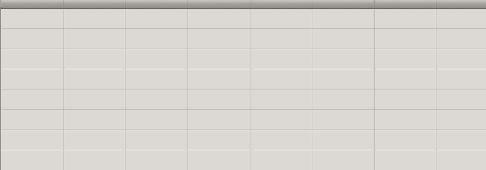

# Cordyceps

**MCP server for Grasshopper.** Give AI agents or scripts direct control over your parametric design canvas.

**[Download Cordyceps.gha](https://github.com/brookstalley/cordyceps/raw/main/releases/Cordyceps.gha)**

## Requirements

- **Rhino 8.21+** (requires .NET 8)
- **MCP client with Streamable HTTP**: Claude Code, Cursor, VS Code Copilot, or any compatible client

## Quick Start

**Install**: Copy `releases/Cordyceps.gha` to your Grasshopper components folder. In Grasshopper: *File → Special Folders → Components Folder*.

**Start**: Drop the Cordyceps component on your canvas (*Params → Util → Cordyceps*). The server starts on port 26929 by default—change it via the Port input if needed.

**Connect**: Configure your MCP client:

```json
{
  "mcpServers": {
    "grasshopper": {
      "type": "streamable-http",
      "url": "http://127.0.0.1:26929/mcp"
    }
  }
}
```

## Usage

**Natural language**: Tell an AI what you want—*"Create a radial array of cylinders with sliders for count and radius"*—and it builds the definition using MCP tools.

**Scripting**: Call tools directly from Python or any MCP client:

```python
async with ClientSession(transport) as session:
    slider = await session.call_tool('add_component', {'type': 'Number Slider', 'x': 50, 'y': 50})
    circle = await session.call_tool('add_component', {'type': 'Curve/Circle', 'x': 200, 'y': 50})
    await session.call_tool('connect_components', {
        'sourceId': slider['id'], 'sourceParam': '0',
        'targetId': circle['id'], 'targetParam': 'R'
    })
```

## Example

Here's what happens when you give Claude this natural language prompt:

> Create an array of cylinders radiating out from the origin on the XY plane, with settings for number of cylinders, length and diameter of the cylinders, and distance from origin. Then make copies of the whole array in Z, with additional settings for number of copies and distance between copies.



The AI interprets the request and builds the complete Grasshopper definition step by step—adding sliders for parameters, dividing a circle to get radial positions, creating direction vectors, generating line axes for each cylinder, piping those lines into solid cylinders, and copying the array in Z.

## Tools

**Canvas**: `add_component`, `delete_component`, `move_component`, `search_components`, `get_all_components`

**Wiring**: `connect_components`, `disconnect_components`, `bulk_connect`, `validate_connection`

**Values**: `set_component_value`, `configure_value_list`, `add_constant`

**Scripts**: `set_script_code`, `configure_script_component`

**Groups**: `create_group`, `add_to_group`, `move_group`, `get_all_groups`

**Inspection**: `get_canvas_status`, `get_disconnected_inputs`, `trace_data_flow`, `get_component_outputs`

**Documents**: `new_document`, `save_document`, `load_document`, `snapshot`, `revert_snapshot`

**Execution**: `set_solver_enabled`, `recompute_solution`, `bake_geometry`, `execute_script`

## Resources

MCP resources provide documentation to clients. Source files are in [`src/Cordyceps/Knowledge/`](src/Cordyceps/Knowledge/).

**Guides:**
- `gh://docs/getting-started` — [GettingStartedGuide.md](src/Cordyceps/Knowledge/GettingStartedGuide.md) — Workflow and key concepts
- `gh://docs/data-trees` — [DataTreesGuide.md](src/Cordyceps/Knowledge/DataTreesGuide.md) — Grasshopper's data tree system
- `gh://docs/type-system` — [TypeSystemGuide.md](src/Cordyceps/Knowledge/TypeSystemGuide.md) — Type compatibility and coercion
- `gh://docs/best-practices` — [BestPracticesGuide.md](src/Cordyceps/Knowledge/BestPracticesGuide.md) — Patterns and recommendations
- `gh://docs/component-patterns` — [ComponentPatternsGuide.md](src/Cordyceps/Knowledge/ComponentPatternsGuide.md) — Common component combinations
- `gh://docs/canvas-layout` — [CanvasLayoutGuide.md](src/Cordyceps/Knowledge/CanvasLayoutGuide.md) — Spacing and layout conventions
- `gh://docs/geometry-orientation` — [GeometryOrientationGuide.md](src/Cordyceps/Knowledge/GeometryOrientationGuide.md) — Planes and orientation

**Patterns:**
- `gh://patterns/linear-array` — [LinearArray.md](src/Cordyceps/Knowledge/Patterns/LinearArray.md) — Copies along a line
- `gh://patterns/grid-array` — [GridArray.md](src/Cordyceps/Knowledge/Patterns/GridArray.md) — 2D/3D grid of copies

**Dynamic:**
- `gh://component/{name}` — Documentation for any Grasshopper component

## Troubleshooting

| Problem | Solution |
|---------|----------|
| Plugin won't load | Verify Rhino 8.21+. Unblock the .gha file (Windows) or clear quarantine (macOS). |
| Can't connect | Ensure Cordyceps component is on canvas. Check the port. |
| Component not found | Use `search_components` to find exact names. |

## Building

```bash
dotnet build src/Cordyceps/Cordyceps.csproj
```

## Acknowledgments

Inspired by [grasshopper-mcp](https://github.com/alfredatnycu/grasshopper-mcp) by Alfred Chen.

## License

MIT
